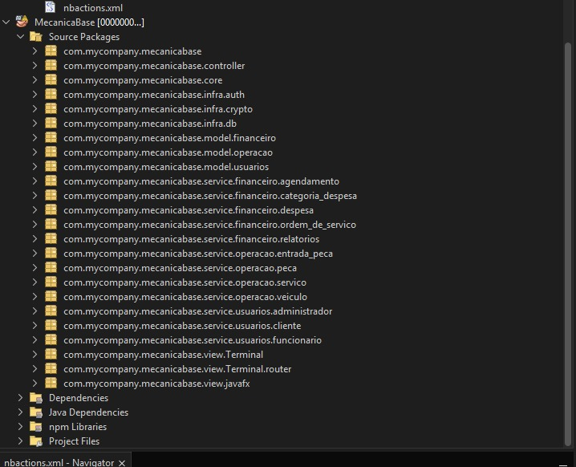
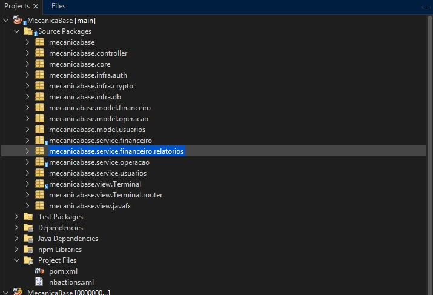

# 🧱 Arquitetura do Projeto

Este documento descreve a evolução da arquitetura do sistema **Mecânica Base**, partindo de uma estrutura inicial baseada em CRUD e separação por casos de uso, até uma arquitetura tradicionalmente adotada em projetos Java.

---

## 📌 Estrutura Anterior

A estrutura inicial foi baseada em uma separação típica de projetos Node.js:

- Divisão por casos de uso (`usecases`)
- Granularidade excessiva: cada operação (CRUD) em uma classe separada
- Lógica duplicada em `TerminalHandler`s
- Pacotes muito profundos e redundantes
- Dificuldade de manutenção na IDE (NetBeans)

```
src/
   └── +---main
    |   +---java
    |   |   +---com
    |   |   |   \---mycompany
    |   |   |       \---mecanicabase
    |   |   |               MecanicaBase.java
    |   |   |
    |   |   +---controllers
    |   |   |       ClienteController.java
    |   |   |       MainViewController.java
    |   |   |
    |   |   +---core
    |   |   |       Entity.java
    |   |   |
    |   |   +---domain
    |   |   |   +---entities
    |   |   |   |   +---financeiro
    |   |   |   |   |       Agendamento.java
    |   |   |   |   |       CategoriaDespesa.java
    |   |   |   |   |       Despesa.java
    |   |   |   |   |       OrdemDeServico.java
    |   |   |   |   |       PecaItem.java
    |   |   |   |   |       ServicoItem.java
    |   |   |   |   |       StatusAgendamento.java
    |   |   |   |   |       StatusOrdemDeServico.java
    |   |   |   |   |
    |   |   |   |   +---operacao
    |   |   |   |   |       Elevador.java
    |   |   |   |   |       EntradaPeca.java
    |   |   |   |   |       Peca.java
    |   |   |   |   |       Servico.java
    |   |   |   |   |       Sistema.java
    |   |   |   |   |       StatusVeiculo.java
    |   |   |   |   |       TipoElevador.java
    |   |   |   |   |       Veiculo.java
    |   |   |   |   |
    |   |   |   |   \---usuarios
    |   |   |   |           Administrador.java
    |   |   |   |           Cliente.java
    |   |   |   |           Colaborador.java
    |   |   |   |           Funcionario.java
    |   |   |   |           Pessoa.java
    |   |   |   |           TipoFuncionario.java
    |   |   |   |
    |   |   |   \---usecases
    |   |   |       +---financeiro
    |   |   |       |   +---agendamento
    |   |   |       |   |       AtualizaAgendamentoUseCase.java
    |   |   |       |   |       BuscarPorIdAgendamentoUseCase.java
    |   |   |       |   |       CriarAgendamentoUseCase.java
    |   |   |       |   |       ListarAgendamentoUseCase.java
    |   |   |       |   |       RemoverAgendamentoUseCase.java
    |   |   |       |   |
    |   |   |       |   +---categoria_despesa
    |   |   |       |   |       AtualizarCategoriaDespesaUseCase.java
    |   |   |       |   |       BuscarPorIdCategoriaDespesaUseCase.java
    |   |   |       |   |       CriarCategoriaDespesaUseCase.java
    |   |   |       |   |       ListarCategoriaDespesaUseCase.java
    |   |   |       |   |       RemoverCategoriaDespesaUseCase.java
    |   |   |       |   |
    |   |   |       |   +---despesa
    |   |   |       |   |       AtualizarDespesaUseCase.java
    |   |   |       |   |       BuscarDespesaPorIdUseCase.java
    |   |   |       |   |       CriarDespesaUseCase.java
    |   |   |       |   |       ListarDespesaUseCase.java
    |   |   |       |   |       RemoverDespesaUseCase.java
    |   |   |       |   |
    |   |   |       |   +---ordem_de_servico
    |   |   |       |   |       AtualizaOrdemDeServicoUseCase.java
    |   |   |       |   |       BuscaPorIdOrdemDeServicoUseCase.java
    |   |   |       |   |       CriarOrdemDeServicoUseCase.java
    |   |   |       |   |       ListaOrdemDeServicoUseCase.java
    |   |   |       |   |       RemoveOrdemDeServicoUseCase.java
    |   |   |       |   |       RemoverPecaItemUseCase.java
    |   |   |       |   |       VenderPecaUseCase.java
    |   |   |       |   |
    |   |   |       |   \---relatorios
    |   |   |       |           GerarBalancoUseCase.java
    |   |   |       |           GerarRelatorioUseCase.java
    |   |   |       |
    |   |   |       +---operacao
    |   |   |       |   +---entrada_peca
    |   |   |       |   |       CriarManualEntradaPecaUseCase.java
    |   |   |       |   |
    |   |   |       |   +---peca
    |   |   |       |   |       AtualizaPecaUseCase.java
    |   |   |       |   |       BuscaPorIdPecaUseCase.java
    |   |   |       |   |       CriarPecaUseCase.java
    |   |   |       |   |       ListaPecaUseCase.java
    |   |   |       |   |       RemovePecaUseCase.java
    |   |   |       |   |
    |   |   |       |   +---servico
    |   |   |       |   |       AtualizaServicoUseCase.java
    |   |   |       |   |       BuscaPorIdServicoUseCase.java
    |   |   |       |   |       CriarServicoUseCase.java
    |   |   |       |   |       ListaServicoUseCase.java
    |   |   |       |   |       RemoveServicoUseCase.java
    |   |   |       |   |
    |   |   |       |   \---veiculo
    |   |   |       |           AtualizaVeiculoUseCase.java
    |   |   |       |           BuscarPorIdVeiculoUseCase.java
    |   |   |       |           CriarVeiculoUseCase.java
    |   |   |       |           ListaVeiculoUseCase.java
    |   |   |       |           RemoverVeiculoUsecase.java
    |   |   |       |
    |   |   |       \---usuarios
    |   |   |           +---administrador
    |   |   |           |       AtualizarAdministradorUseCase.java
    |   |   |           |       BuscaPorIdAdministradorUseCase.java
    |   |   |           |       CriarAdministradorUseCase.java
    |   |   |           |       ListarAdministradorUseCase.java
    |   |   |           |       LoginAdministradorUseCase.java
    |   |   |           |       RemoverAdministradorUseCase.java
    |   |   |           |
    |   |   |           +---cliente
    |   |   |           |       AtualizaClienteUseCase.java
    |   |   |           |       BuscaPorIdClienteUseCase.java
    |   |   |           |       CriarClienteUseCase.java
    |   |   |           |       ListaClienteUseCase.java
    |   |   |           |       RemoveClienteUseCase.java
    |   |   |           |
    |   |   |           \---funcionario
    |   |   |                   AtualizaFuncionarioUseCase.java
    |   |   |                   BuscaPorIdFuncionarioUseCase.java
    |   |   |                   CriarFuncionarioUseCase.java
    |   |   |                   ListaFuncionarioUseCase.java
    |   |   |                   LoginFuncionarioUseCase.java
    |   |   |                   RemoveFuncionarioUseCase.java
    |   |   |
    |   |   +---infra
    |   |   |   +---auth
    |   |   |   |       Session.java
    |   |   |   |
    |   |   |   +---crypto
    |   |   |   |       JasyptCrypto.java
    |   |   |   |
    |   |   |   \---db
    |   |   |           Database.java
    |   |   |
    |   |   \---presentation
    |   |       +---Terminal
    |   |       |   |   AgendamentoTerminalHandler.java
    |   |       |   |   CategoriaDespesaTerminalHandler.java
    |   |       |   |   ClienteTerminalHandler.java
    |   |       |   |   ColaboradorTerminalHandler.java
    |   |       |   |   DespesaTerminalHandler.java
    |   |       |   |   GerarBalancoTerminalHandler.java
    |   |       |   |   GerarRelatorioTerminalHandler.java
    |   |       |   |   LoginTerminalHandler.java
    |   |       |   |   OficinaTerminalHandler.java
    |   |       |   |   OrdemDeServicoTerminalHandler.java
    |   |       |   |   PecaTerminalHandler.java
    |   |       |   |   ServicoTerminalHandler.java
    |   |       |   |   VeiculoTerminalHandler.java
    |   |       |   |
    |   |       |   \---router
    |   |       |           TerminalRouter.java
    |   |       |
    |   |       \---view
    |   |               main.css
    |   |               Main.fxml
    |   |               MainView.java
    |   |
    |   \---resources
```

---

### 🌐 Visualização da Estrutura Anterior



## ✅ Estrutura Atual (Refatorada com Crud<T>)

Com a adoção de um CRUD genérico (`Crud<T>`), a estrutura foi drasticamente simplificada:

- Redução de dezenas de arquivos para apenas um por entidade
- Reutilização de lógica em `Crud<T>` evitando código duplicado
- Pacotes mais enxutos e coesos
- Mais escalabilidade e legibilidade
- Terminal Handlers permanecem separados por responsabilidade de interação
- Agrupamento por **entidade e responsabilidade**
- Redução da granularidade de classes
- Camadas mais claras: `model`, `repository`, `service`, `controller`, `view`
- Views centralizadas (CLI ou GUI)
- Menor acoplamento entre camadas
- Banco de dados simulado via `database.json` (requisito da disciplina)

```
src/
└── main/
│   └───java
│       └───mecanicabase
│           │   MecanicaBase.java
│           │
│           ├───controller
│           │       AgendamentoController.java
│           │       ClienteController.java
│           │       MainViewController.java
│           │
│           ├───core
│           │       Autenticavel.java
│           │       Crud.java
│           │       Entity.java
│           │
│           ├───infra
│           │   ├───auth
│           │   │       Session.java
│           │   │
│           │   ├───crypto
│           │   │       JasyptCrypto.java
│           │   │
│           │   └───db
│           │           Database.java
│           │
│           ├───model
│           │   ├───financeiro
│           │   │       Agendamento.java
│           │   │       CategoriaDespesa.java
│           │   │       Despesa.java
│           │   │       OrdemDeServico.java
│           │   │       PecaItem.java
│           │   │       ServicoItem.java
│           │   │       StatusAgendamento.java
│           │   │       StatusOrdemDeServico.java
│           │   │
│           │   ├───operacao
│           │   │       Elevador.java
│           │   │       EntradaPeca.java
│           │   │       Peca.java
│           │   │       Servico.java
│           │   │       Sistema.java
│           │   │       StatusVeiculo.java
│           │   │       TipoElevador.java
│           │   │       Veiculo.java
│           │   │
│           │   └───usuarios
│           │           Administrador.java
│           │           Cliente.java
│           │           Colaborador.java
│           │           Funcionario.java
│           │           Pessoa.java
│           │           TipoFuncionario.java
│           │
│           ├───service
│           │   ├───financeiro
│           │   │   │   AgendamentoCrud.java
│           │   │   │   CategoriaDespesaCrud.java
│           │   │   │   DespesaCrud.java
│           │   │   │   OrdemDeServicoCrud.java
│           │   │   │
│           │   │   └───relatorios
│           │   │           GerarBalancoUseCase.java
│           │   │           GerarRelatorioUseCase.java
│           │   │
│           │   ├───operacao
│           │   │       PecaCrud.java
│           │   │       ServicoCrud.java
│           │   │       VeiculoCrud.java
│           │   │
│           │   └───usuarios
│           │           AdministradorCrud.java
│           │           ClienteCrud.java
│           │           FuncionarioCrud.java
│           │           UsuarioCrud.java
│           │
│           └───view
│               ├───javafx
│               │       main.css
│               │       Main.fxml
│               │       MainView.java
│               │
│               └───Terminal
│                   │   AgendamentoTerminalHandler.java
│                   │   CategoriaDespesaTerminalHandler.java
│                   │   ClienteTerminalHandler.java
│                   │   ColaboradorTerminalHandler.java
│                   │   DespesaTerminalHandler.java
│                   │   GerarBalancoTerminalHandler.java
│                   │   GerarRelatorioTerminalHandler.java
│                   │   LoginTerminalHandler.java
│                   │   OficinaTerminalHandler.java
│                   │   OrdemDeServicoTerminalHandler.java
│                   │   PecaTerminalHandler.java
│                   │   ServicoTerminalHandler.java
│                   │   VeiculoTerminalHandler.java
│                   │
│                   └───router
│                           TerminalRouter.java
│
└───test
    └───java
```

---

### 📈 Benefícios da Refatoração

| Aspecto             | Antes                    | Depois                            |
| ------------------- | ------------------------ | --------------------------------- |
| Total de pacotes    | ⬇️ Muitos (casos de uso) | ⬆️ Reduzidos a módulos principais |
| Repetição de código | ❌ Alta                  | ✅ Quase nula com `Crud<T>`       |
| Escalabilidade      | ❌ Baixa                 | ✅ Alta                           |
| Manutenção          | ❌ Difícil               | ✅ Facilitada                     |

### 🌎 Visualização da Estrutura Atual



## 🧠 Princípios adotados

- Separação de responsabilidades (SRP)
- Inversão de dependência por interfaces (Repository Pattern)
- Redução de classes com responsabilidades mínimas
- Adoção de JavaFX ou Terminal como view desacoplada
- Simulação de persistência via arquivo JSON (`database.json`)

---

## 🤔 Considerações Arquiteturais

- Uso de `Crud<T>` genérico para padronizar operações
- Controllers desacoplados da lógica
- Views separadas para terminal e JavaFX
- Simulação de persistência com `database.json`

---

## 🌐 Próximos passos

- Atualizar diagramas e documentação UML
- Melhorar injeção de dependências
- Consolidar testes automatizados
