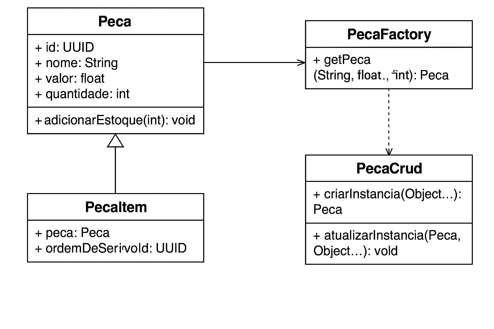

# 🧠 Padrão de Projeto: Flyweight

## 📌 O que é o padrão Flyweight?

O padrão **Flyweight** é um padrão estrutural utilizado para **economizar memória** ao compartilhar objetos semelhantes. Ele é útil nos seguintes cenários:

- Quando há **muitos objetos parecidos**, com **dados imutáveis** ou que podem ser externalizados;
- Quando se deseja **evitar a criação repetida** de objetos que diferem apenas por **dados contextuais pequenos** (ex: quantidade, posição, dono, etc).

---

## 🔍 Aplicação no Sistema

Este sistema representa uma **oficina mecânica**, com entidades como:

- `OrdemDeServico`
- `Servico`
- `Peca`
- `Cliente`
- `Funcionario`
- `Elevador`
- `Agendamento`
- `Despesa`

O padrão Flyweight **não é aplicável à maioria dessas entidades**, pois carregam estado individual e mutável (ex: status, datas, relacionamentos únicos).

---

## 🎯 Flyweight aplicado à classe `Peca`

### Justificativa:

- O sistema lida com **centenas de peças por veículos**.
- Muitas peças são **reutilizadas em diferentes ordens de serviço** e entre diversos modelos de carro.
- Os dados centrais das peças (nome, código, marca, categoria, valor unitário) são geralmente **imutáveis**.
- Aplicar Flyweight aqui evita **criação redundante de objetos com mesmas características**, otimizando uso de memória.

### Estratégia:

- Criar uma **fábrica Flyweight** de `Peca`, que retorna instâncias únicas para cada tipo de peça baseada em seus atributos fixos (ex: código ou nome).
- Dados contextuais como `quantidade`, `local de uso`, ou `ordem de serviço` serão armazenados **fora** do objeto `Peca`, na classe `PecaItem` (associação com contexto).

# 📊 Diagrama proposto UML do Padrão Flyweight aplicado à `Peca`

Abaixo está o diagrama de classes representando a aplicação do padrão **Flyweight** ao modelo `Peca`:



> Este diagrama ilustra a interação entre `Peca`, `PecaItem`, `PecaFactory` e `PecaCrud`. O objetivo é garantir que instâncias de peças com as mesmas características sejam compartilhadas em memória, enquanto `PecaItem` armazena o contexto de uso (como a OS associada).

---

## ⚠️ Quando _não_ aplicar Flyweight (Anti-Padrão)

- Quando os objetos têm **estado mutável frequente** (ex: estoque atual, status de uso);
- Quando a implementação do padrão adiciona **mais complexidade do que benefícios reais**;
- Quando não há **grande volume de objetos iguais** no sistema.

---

## ✅ Tabela de Avaliação

| Classe    | Flyweight Aplicável? | Justificativa                                                                |
| --------- | -------------------- | ---------------------------------------------------------------------------- |
| `Peca`    | ✅ Sim               | Muitas instâncias, atributos imutáveis, alto reaproveitamento                |
| `Servico` | ❌ Não               | Poucos serviços (~50), instâncias limitadas, ganho irrelevante               |
| Outras    | ❌ Não               | Estado individual e mutável (ex: `Cliente`, `Funcionario`, `OrdemDeServico`) |

---

## 🛠️ Exemplo Futuro: `PecaFactory`

> O padrão será aplicado por meio de uma fábrica que mantém um cache de instâncias reutilizáveis de peças, com acesso via código/nome.

```java
public class PecaFactory {
    private static final Map<String, Peca> cache = new HashMap<>();

    public static Peca getPeca(String codigo, String nome, String categoria, double valor) {
        String chave = codigo;
        if (!cache.containsKey(chave)) {
            cache.put(chave, new Peca(codigo, nome, categoria, valor));
        }
        return cache.get(chave);
    }
}
```
