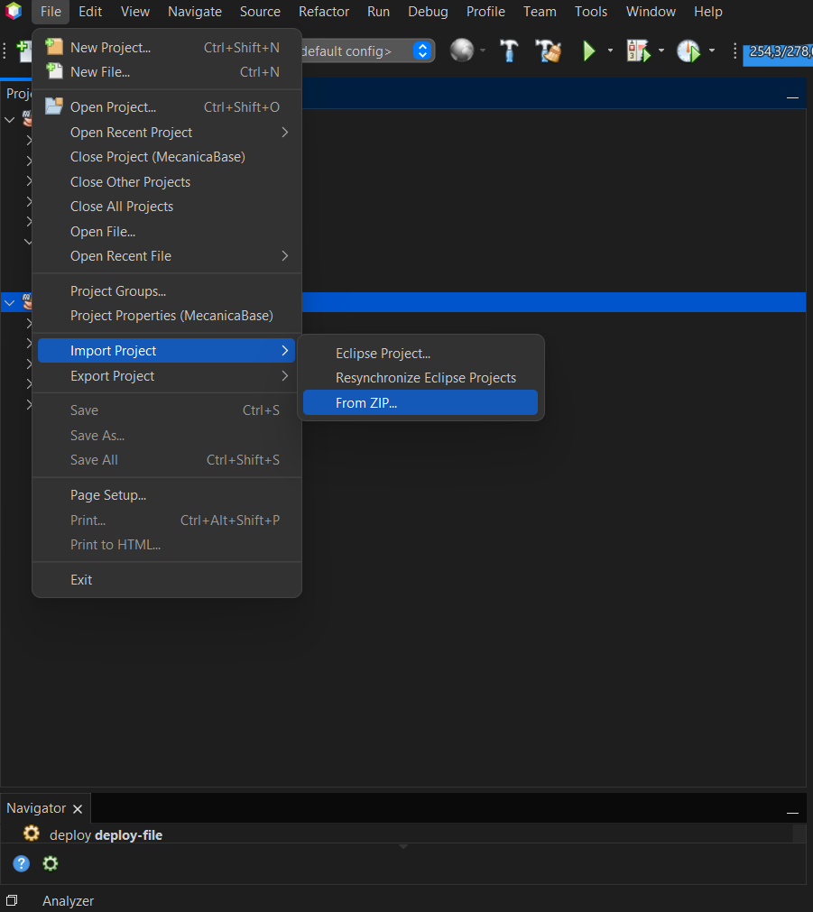

# 🛠️ Como instalar e importar o projeto no NetBeans

Este guia explica como baixar a versão mais recente do MecânicaBase e importar o projeto diretamente no NetBeans.

---

## 📥 1. Baixando a Release

1. Acesse a página de [Releases do projeto](https://github.com/4snt/MecanicaBase/releases)
2. Clique na versão desejada (ex: `v3.0.3`)
3. Baixe o arquivo `.zip` do código-fonte ou da release

---

## 📂 2. Importando o projeto no NetBeans (via ZIP)

1. Abra o **NetBeans**
2. Vá em **File > Import Project > From ZIP...**
3. Selecione o arquivo `.zip` que você baixou da Release
4. O NetBeans vai importar automaticamente como um projeto Maven

📸 _Exemplo da tela:_

---

## ▶️ 3. Rodando o projeto

Após a importação:

1. Clique com o botão direito no projeto `MecanicaBase`
2. Selecione **Run** ou pressione `F6`

---

## ✅ Requisitos

- Java JDK 17 ou superior instalado
- NetBeans 15 ou superior recomendado
- Conexão com a internet para baixar dependências do Maven

---

Pronto! O projeto MecânicaBase estará configurado e pronto para uso no seu ambiente.
