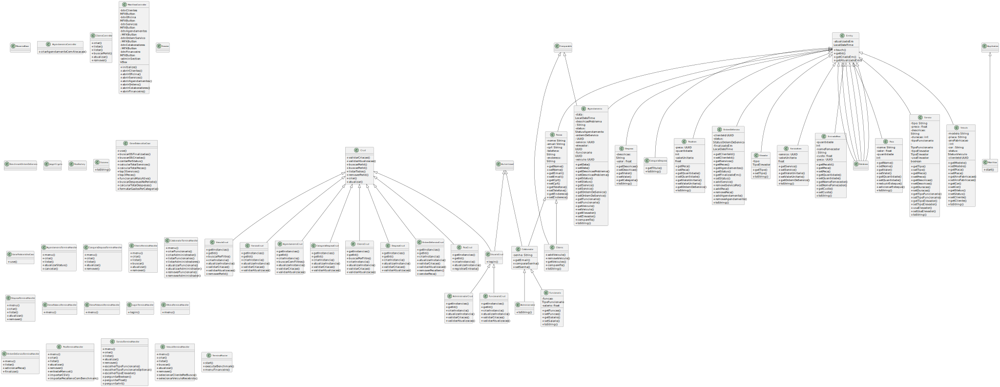

# Mecânica Base 🛠️

Projeto Java para gerenciamento de uma oficina mecânica. Criado com foco educacional e arquitetura limpa.

> **📘 Projeto desenvolvido como Trabalho Prático I da disciplina de Programação Orientada a Objetos – POO, UFVJM – 2025/1, sob orientação do professor Eduardo Pelli.** > **👥 Participantes**: Murilo Santiago Escobedo · Luís Cláudio Prado · Pávila Miranda Cardoso

---

## 🗂 Documentação

- [Como instalar/importar no netbeans: ](documentation/instalation.md)
- [✅ Checklist – Entrega 1](documentation/entrega1.md)
- [Arquitetura do Projeto](documentation/arquitetura.md)
- [Entidades e Relacionamentos](documentation/entidades.md)
- [Casos de Uso](documentation/casos-de-uso.md)
- [Regras de Negócio](documentation/regras-de-negocio.md)
- [Como Rodar (Setup)](documentation/setup-dev.md)
- [Roadmap de Melhorias](documentation/roadmap.md)

### 📐 Diagrama de Classes (PlantUML)

O diagrama completo de classes é **gerado automaticamente** a partir do código‑fonte por um script Python que varre `src/main/java`, monta um arquivo `.puml` e, em seguida, usa **PlantUML** para produzir o SVG.



O script faz parte do fluxo `npm run release`, garantindo que o diagrama esteja sempre atualizado a cada versão.

---

## 🚀 CI/CD e Versionamento

Este projeto conta com um fluxo automatizado de versionamento e empacotamento usando **npm**, **standard‑version**, **Maven** e **PowerShell**.

### 🔧 Scripts configurados

- `npm run release`: executa todo o processo de release, que inclui:

  - Geração do diagrama de classes (PlantUML)
  - Geração da documentação Javadoc com `mvn javadoc:javadoc`
  - Criação de uma nova versão semântica (`standard-version`)
  - Geração de um arquivo `.zip` com a estrutura do projeto para ser importado diretamente no NetBeans

### 📦 Empacotamento

O release gera automaticamente um arquivo **`MecanicaBase.zip`** contendo a estrutura padrão de projeto exigida pelo NetBeans:

```
MecanicaBase.zip
└── MecanicaBase/
    ├── nbproject/
    ├── src/
    ├── pom.xml
    └── ...
```

### 📚 Javadoc

A documentação Javadoc é gerada na pasta `target/site/apidocs` e está hospedada publicamente no Vercel para consulta online:
👉 **[https://mecanica-base.vercel.app/](https://mecanica-base.vercel.app/)**

> Para evitar poluir o repositório, o diretório `target/` está no `.gitignore`, exceto a pasta `target/reports/` caso precise ser usada.

### 📝 Commits Semânticos

O versionamento do projeto segue a convenção de commits semânticos (e.g. `feat:`, `fix:`, `refactor:`). Isso permite a geração automática de changelogs e controle preciso de versões.
